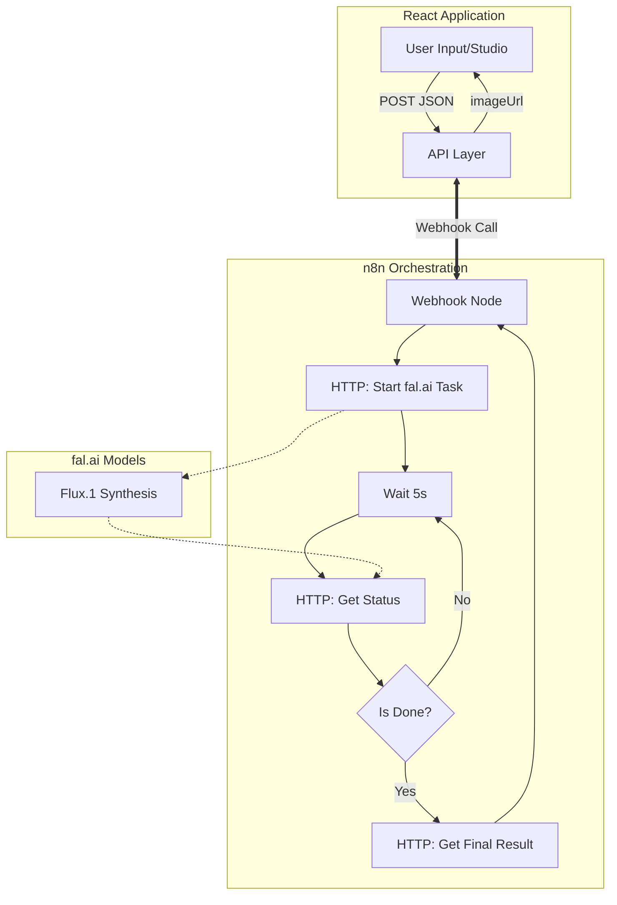

# DRAPE: AI-Powered Fashion Designer (n8n + Flux)

**DRAPE** is a high-end AI design tool that bridges the gap between creative sketches and realistic model photography. By leveraging **n8n** as an orchestration layer and **fal.ai (Flux.1)** for image synthesis, DRAPE allows designers to visualize their sketches on real models with specific fabric simulations.

## 📺 Demo

<!-- 
HOW TO ADD YOUR VIDEO:
1. Push your project to GitHub.
2. Open a GitHub Issue or PR in your repo.
3. Drop your mp4/mov file into the comment box.
4. Copy the generated link (starts with https://github.com/user/project/assets/...)
5. Paste that link into the 'src' attribute of the <video> tag below.
-->

<div align="center">
  <video src="YOUR_DIRECT_GITHUB_VIDEO_URL_HERE" width="100%" controls autoplay muted loop>
    Your browser does not support the video tag.
  </video>
</div>


### 🏗 Architecture



### 🚀 Key Features
- **Sketch-to-Model**: Seamless transformation of 2D sketches into 3D-realistic model photos.
- **Fabric Simulation**: Support for Cotton, Silk, Linen, and more via smart prompting.
- **n8n Orchestration**: Scalable backend logic handled without a traditional server (Serverless approach).
- **Modern UI**: Built with React 18, TypeScript, and Tailwind CSS.

### 🛠 Setup & Installation

1. **Clone & Install**:
   ```bash
   npm install
   ```
2. **Environment Configuration**:
   Create a `.env` file based on the template:
   ```env
   VITE_N8N_WEBHOOK_URL=your_n8n_webhook_url
   FAL_AI_API_KEY=your_fal_ai_key
   ```
3. **n8n Workflow**:
   - Import the `n8n/runway-ai.json` file into your n8n instance.
   - Configure the `HTTP Request` nodes with your `FAL_AI_API_KEY`.
4. **Run**:
   ```bash
   npm run dev
   # OR use Docker
   docker-compose up --build
   ```

### 📂 Project Structure
- `src/`: React application source code.
- `n8n/`: n8n workflow JSON files and [technical documentation](n8n/README.md).
- `docker-compose.yml`: Docker configuration for easy deployment.

### ⚙️ Technical Implementation Details
This project is an example of an **AI Agent/Workflow** integration, moving beyond simple API calls:
- **Decoupled Architecture**: Frontend and AI logic are completely decoupled via n8n.
- **Polling Logic**: Asynchronous requests from fal.ai are managed on n8n with "wait & check status" logic to ensure reliability.
- **Prompt Engineering**: The prompt structure within n8n optimizes fabric and visual data before sending it to the model.

---

**Developed for the next generation of fashion designers.**
